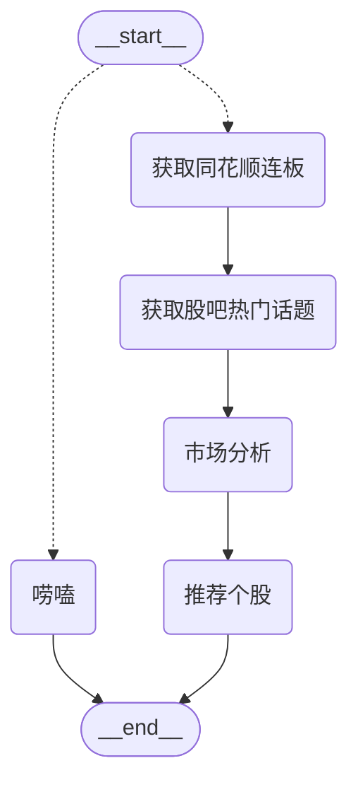

# 卧龙AI炒家

这是一个基于LangGraph和FastHTML的A股大模型Agent



## 快速开始

1. 重命名`.env_example`为`.env`并填写必要信息。具体说明如下：
   - `BASE_URL`: 填入兼容OpenAI API的大模型URL
   - `OPENAI_KEY`: 填入兼容OpenAI API格式的模型密钥
   - `MODEL`: 指定要使用的模型名称（例如：gpt-3.5-turbo）

2. 创建并激活虚拟环境：
   ```
   python3 -m venv venv
   source venv/bin/activate
   ```

3. 安装依赖：
   ```
   pip3 install -r requirements.txt
   ```

4. 运行应用：
   ```
   python app.py
   ```

## 功能特点

- 获取同花顺连板和东财股吧话题
- 支持显示数据源iframe
- 实时流式响应
- Markdown渲染支持
- 自动加载初始问题"最新复盘"

## 项目结构

- `app.py`: 主应用文件，包含FastAPI路由和UI组件
- `graph_reviewer.py`: 包含`reviewAgent`类，负责处理用户查询和生成响应

## 支持

如果您觉得这个项目有帮助，可以考虑给我买杯咖啡：

[](https://www.paypal.com/paypalme/franklin755)
